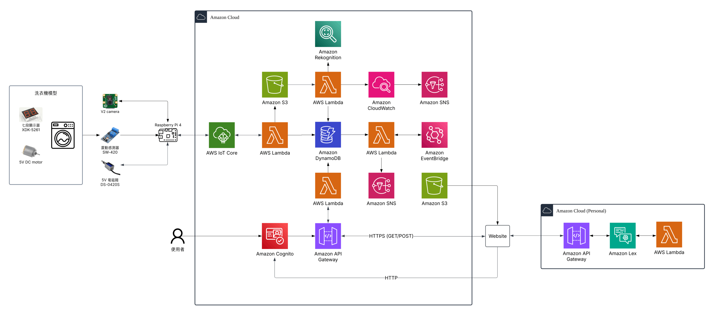

# 公用洗衣機智慧提醒系統｜Smart Washer Notification System

> 宿舍洗衣機資源有限，洗完沒取出導致機台閒置。本系統透過 IoT 感測 + AWS 雲端，自動偵測洗衣狀態並即時通知使用者。
>
> Shared dormitory washers sit idle when laundry isn't picked up. This system uses IoT sensors and AWS cloud services to automatically detect washer status and notify users in real time.

本 repo 為 113-2 國立清華大學雲端程式設計課程第 6 組期末專案。課程結束後補全 Terraform IaC，使部署環境可在任意 AWS 帳號重現。

*This repo is the 113-2 NTHU Cloud Programming group final project. Post-course, full Terraform IaC was added to make the system fully reproducible on any AWS account.*

📑 [簡報 Slides](https://drive.google.com/file/d/1e8tcUKsSb5AWoy7UB3i3GPrfbrgC5sVS/view?usp=sharing) ・ 🎥 [專案介紹 + Demo 影片](https://drive.google.com/file/d/1jfq16J0ZoaIcaZMJMjlO0rIzHEOMPdVS/view?usp=sharing)

---

## 系統架構｜System Architecture

<p align="center">
  <a href="docs/CP_team6_final_project_architecture.png">
    
  </a>
</p>

系統分為三層：**IoT 裝置端**（Raspberry Pi 偵測震動、拍攝面板、控制門鎖）、**AWS 雲端處理端**（Lambda 處理業務邏輯、Rekognition OCR 辨識剩餘時間、SNS 推播通知）、**使用者網頁端**（S3 靜態網站 + Cognito 登入）。

The system has three layers: **IoT Device** (Raspberry Pi detects vibration, captures display images, controls door lock), **AWS Cloud Backend** (Lambda for business logic, Rekognition OCR for remaining time, SNS notifications), and **Web Frontend** (S3 static site + Cognito auth).

---

## 系統亮點｜Key Features

- **自動 OCR 辨識剩餘時間**：Raspberry Pi 相機拍攝洗衣機面板，透過 AWS Rekognition 自動讀取倒數數字，無需手動輸入
- **IoT Device Shadow 雙向控制**：雲端可主動推送門鎖指令給裝置，裝置離線時狀態自動快取，上線後同步
- **事件驅動架構**：DynamoDB Stream 觸發通知 Lambda，業務邏輯解耦，各模組獨立運作
- **完整 IaC**：Terraform 一鍵部署所有 AWS 資源（11 個服務、17 個 Lambda），環境可完整重現

---

## 技術選型｜Tech Stack

### AWS 雲端服務｜AWS Services

| 服務 | 選用原因 |
|------|----------|
| **IoT Core** | MQTT 協定支援、Device Shadow 實現雲端與裝置雙向狀態同步 |
| **Lambda** | 事件驅動、無伺服器，17 個函式各自對應獨立業務場景 |
| **DynamoDB** | Streams 支援事件觸發下游 Lambda，毫秒級讀寫 |
| **S3** | 靜態網站託管與影像儲存合一，無需額外 web server |
| **Rekognition** | 零訓練成本的 OCR，直接辨識洗衣機面板數字 |
| **SNS** | FilterPolicy 支援按用戶 email 篩選通知，避免誤發 |
| **Cognito** | 內建 JWT 驗證，API Gateway 直接整合，無需自建 auth |
| **API Gateway** | 與 Lambda 無縫整合，支援 Cognito Authorizer |
| **EventBridge Scheduler** | 動態建立／刪除排程，適合預約到期釋放場景 |
| **Lex V2** | 中文自然語言查詢洗衣機狀態 |
| **CloudWatch** | 自訂 Metric Alarm，Rekognition 連續失敗時自動告警 |

### IoT 裝置與硬體｜IoT & Hardware

| 元件 | 用途 |
|------|------|
| Raspberry Pi 3 / 4 | 主控制器 |
| V2 Camera Module | 拍攝洗衣機面板倒數畫面 |
| SW-420 震動感測器 | 偵測洗衣機是否運轉 |
| DS-0420S 電磁閥 | 門鎖控制 |
| 七段顯示器 | 顯示剩餘時間 |

### 前端｜Frontend

HTML / CSS / JavaScript（Vite 建置）・S3 Static Hosting・Cognito 登入驗證

---

## 快速開始｜Quick Start

```bash
git clone https://github.com/Iris6636/cloud-programming-smart-washer.git
cd cloud-programming-smart-washer/deployment/infra
cp terraform.tfvars.example terraform.tfvars
# 填入你的 Email 與 S3 bucket 名稱
terraform init && terraform apply
```

完整部署流程（含 DynamoDB 初始化、Cognito 使用者建立、前端部署、IoT 憑證設定）請見：

**[docs/deployment_guide.md](docs/deployment_guide.md)**

---

## 專案結構｜Project Structure

```
cloud-programming-smart-washer/
├── backend/lambda_functions/   # 17 個 Python Lambda 原始碼
├── chatbot/                    # Lex V2 聊天機器人匯出檔
├── deployment/
│   ├── infra/                  # Terraform IaC（terraform apply 即可部署）
│   ├── lambda/                 # Lambda .zip 部署包
│   ├── scripts/                # 部署輔助腳本
│   └── reference/              # terraformer 匯出快照（僅供參考）
├── docs/                       # 部署指南、IoT 設定、API 文件
├── iot/actuator/               # Raspberry Pi 裝置端程式
└── web/frontend/               # 前端網頁（Vite 建置）
```

---

## 相關文件｜Documentation

| 文件 | 說明 |
|------|------|
| [docs/deployment_guide.md](docs/deployment_guide.md) | 完整 Terraform 部署指南（Step 1–11）|
| [docs/iot_setup_guide.md](docs/iot_setup_guide.md) | IoT 裝置硬體接線與憑證設定 |
| [docs/API Gateway Setup.md](docs/API%20Gateway%20Setup.md) | API Gateway 設定步驟 |
| [chatbot/AWS_lex_setting_README.md](chatbot/AWS_lex_setting_README.md) | Lex V2 聊天機器人設定 |

---

## 團隊成員｜Team Members

雲端程式設計 第 6 組｜Group 6 — Cloud Programming

- 吳君慧 Peggy Wu
- 何佳穎 Chia-Ying Ho
- 簡宏諭 Hung-Yu Chien
- 邱子洋 Tzu-Yang Chiu
